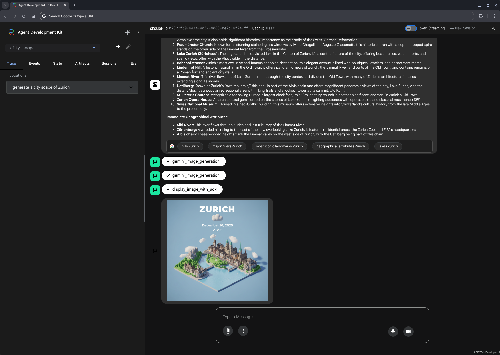
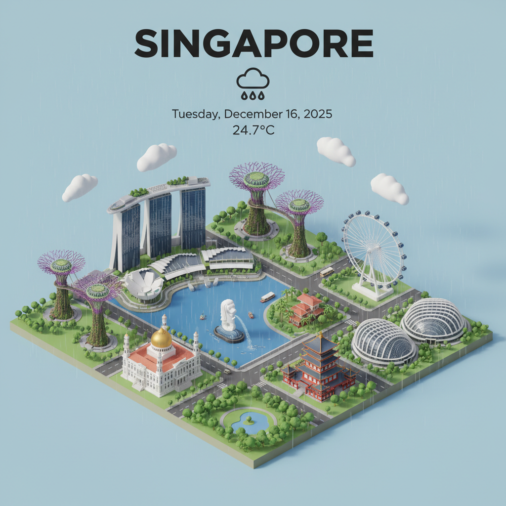
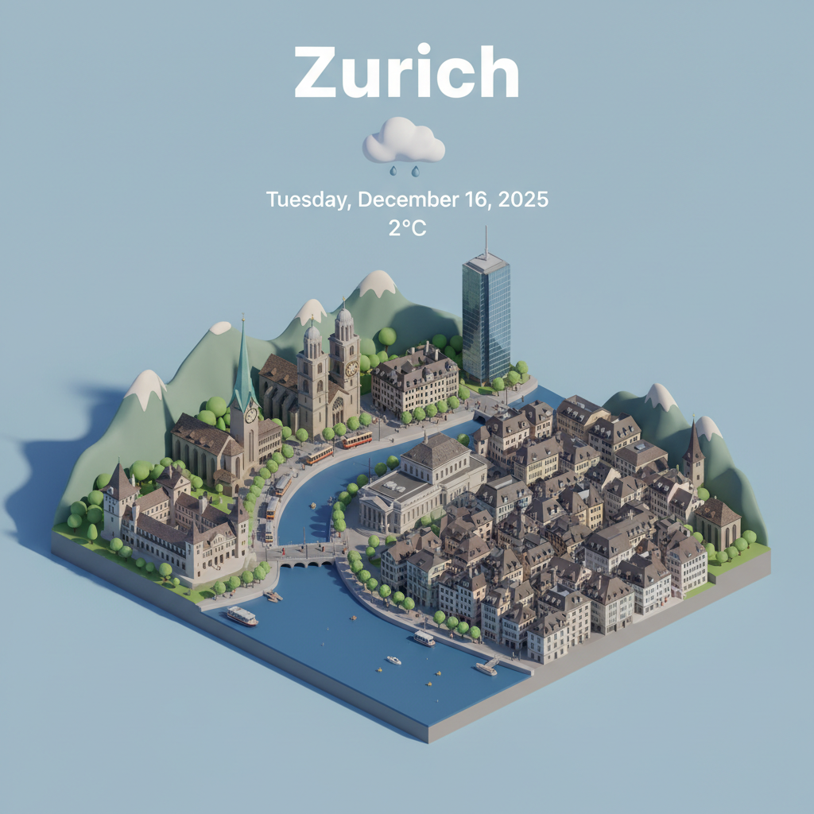
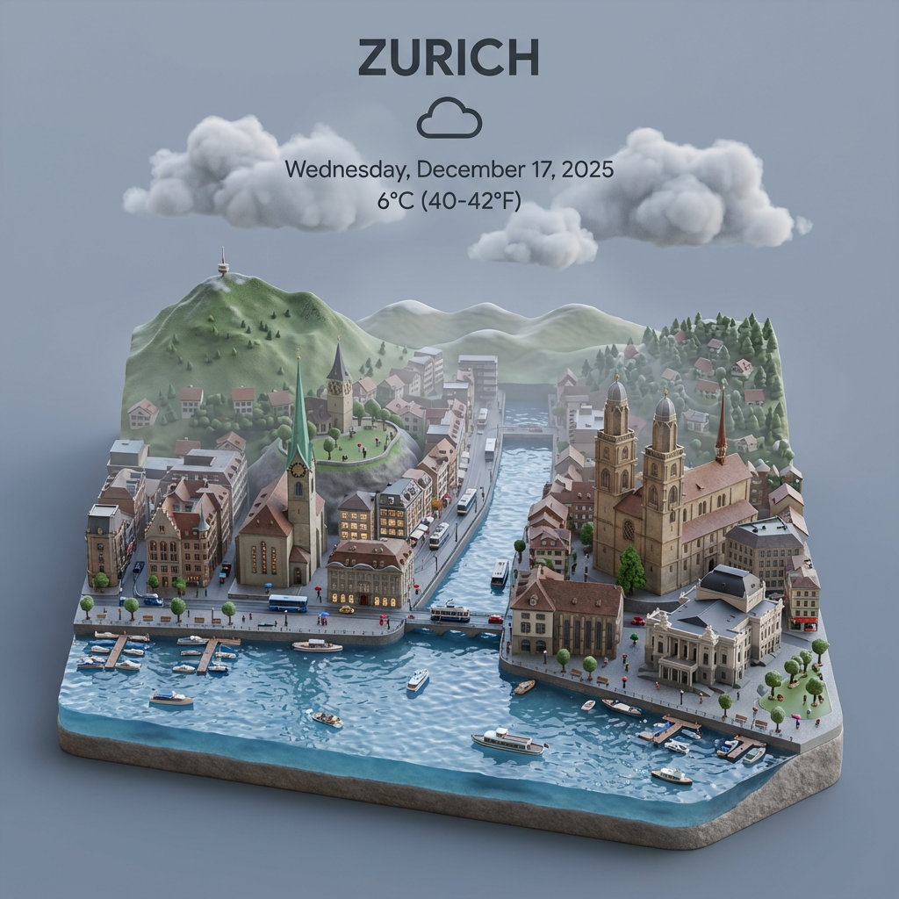

# ADK Example - Cityscape

This repository contains an example agent built with the Application Development Kit (ADK). The agent, `cityscape`, demonstrates how to integrate with various services to generate cityscape images based on user prompts. It uses the Google Maps Grounding Lite MCP Server for location information and the Nano Banana (via GenMedia MCP Server) model for image generation.

## Activate GCP Services

```sh
gcloud services enable aiplatform.googleapis.com \
    artifactregistry.googleapis.com \
    cloudbuild.googleapis.com \
    run.googleapis.com --project $PROJECT_ID
```

## MCP Servers

The following MCP servers need to be prepared:

### Google Maps Grounding Lite MCP Server

See offical [documentation](https://developers.google.com/maps/ai/grounding-lite).

```sh
gcloud beta services enable mapstools.googleapis.com --project=$PROJECT_ID
gcloud beta services mcp enable mapstools.googleapis.com --project=$PROJECT_ID
```

Get a Maps API Key and limit it to `mapstools.googleapis.com`.

```sh
gcloud services api-keys create \
    --display-name="Cityscape Maps MCP" \
    --key-id="cityscape-maps-mcp" \
    --api-target="service=mapstools.googleapis.com" \
    --project $PROJECT_ID
```

Export it as a local variable for local development:

```sh
export MAPS_API_KEY="$(gcloud services api-keys get-key-string "cityscape-maps-mcp" --project $PROJECT_ID --format "value(keyString)")"
```

### Nano Banana via GenMedia MCP Server

See offical [documentation](https://github.com/GoogleCloudPlatform/vertex-ai-creative-studio/tree/main/experiments/mcp-genmedia) for how to install it for local development. 

## Get Started

```sh
python -m venv .venv
source .venv/bin/activate
pip install -r requirements.txt 
```

```sh
adk web ./agents
```

Try a prompt like (with any arbitrary city):

```txt
Generate a cityscape for Zurich
```

## Deploy to Cloud Run

### Build Permissions

Ensure the default Compute Engine service account (used by Cloud Build for deployment) has permissions to access storage (for source code), write to Artifact Registry, and write logs.

```sh
PROJECT_NUMBER=$(gcloud projects describe $PROJECT_ID --format='value(projectNumber)')
gcloud projects add-iam-policy-binding $PROJECT_ID \
    --member="serviceAccount:${PROJECT_NUMBER}-compute@developer.gserviceaccount.com" \
    --role="roles/storage.objectUser"
gcloud projects add-iam-policy-binding $PROJECT_ID \
    --member="serviceAccount:${PROJECT_NUMBER}-compute@developer.gserviceaccount.com" \
    --role="roles/artifactregistry.writer"
gcloud projects add-iam-policy-binding $PROJECT_ID \
    --member="serviceAccount:${PROJECT_NUMBER}-compute@developer.gserviceaccount.com" \
    --role="roles/logging.logWriter"
```

### Create Service Account

Create a dedicated service account for the application:

```sh
SERVICE_ACCOUNT_NAME="cityscape-sa"
gcloud iam service-accounts create $SERVICE_ACCOUNT_NAME \
    --display-name="Cityscape Agent Service Account" \
    --project=$PROJECT_ID
```

Grant the necessary permissions (Vertex AI User for model access, Logging and Monitoring for observability):

```sh
gcloud projects add-iam-policy-binding $PROJECT_ID \
    --member="serviceAccount:${SERVICE_ACCOUNT_NAME}@${PROJECT_ID}.iam.gserviceaccount.com" \
    --role="roles/aiplatform.user"
gcloud projects add-iam-policy-binding $PROJECT_ID \
    --member="serviceAccount:${SERVICE_ACCOUNT_NAME}@${PROJECT_ID}.iam.gserviceaccount.com" \
    --role="roles/logging.logWriter"
gcloud projects add-iam-policy-binding $PROJECT_ID \
    --member="serviceAccount:${SERVICE_ACCOUNT_NAME}@${PROJECT_ID}.iam.gserviceaccount.com" \
    --role="roles/monitoring.metricWriter"
```

### Setup Maps API Key Secret

Create a secret for the Maps API Key in Secret Manager:

```sh
gcloud secrets create maps-api-key --replication-policy="automatic" --project=$PROJECT_ID
gcloud services api-keys get-key-string "cityscape-maps-mcp" --project $PROJECT_ID --format "value(keyString)" \
 | gcloud secrets versions add maps-api-key --data-file=- --project=$PROJECT_ID
```

Grant the service account access to the secret:

```sh
gcloud secrets add-iam-policy-binding maps-api-key \
    --member="serviceAccount:${SERVICE_ACCOUNT_NAME}@${PROJECT_ID}.iam.gserviceaccount.com" \
    --role="roles/secretmanager.secretAccessor" \
    --project=$PROJECT_ID
```

### Deploy Service

Follow the instructions here 

```sh
CLOUD_RUN_REGION=europe-west1

gcloud run deploy cityscape-agent \
--source . \
--region $CLOUD_RUN_REGION \
--project $PROJECT_ID \
--no-allow-unauthenticated \
--service-account="${SERVICE_ACCOUNT_NAME}@${PROJECT_ID}.iam.gserviceaccount.com" \
--set-env-vars="GOOGLE_CLOUD_PROJECT=$PROJECT_ID,GOOGLE_CLOUD_LOCATION=global,GOOGLE_GENAI_USE_VERTEXAI=true,SERVE_WEB_INTERFACE=true" \
--set-secrets="MAPS_API_KEY=maps-api-key:latest"
```

To access it for testing purposes, create a [Cloud Run IAP](https://docs.cloud.google.com/run/docs/securing/identity-aware-proxy-cloud-run) or use the [Cloud Run auth proxy](https://docs.cloud.google.com/sdk/gcloud/reference/run/services/proxy).

## Screenshot



## Example Generated Images

Here are some examples of what this agent generates

| Rome | Singapore | Zurich | Zurich (Nano Banana Pro) |
|---|---|---|---|
|  |  |  | | 

## Disclaimer

This is not an official Google product.
